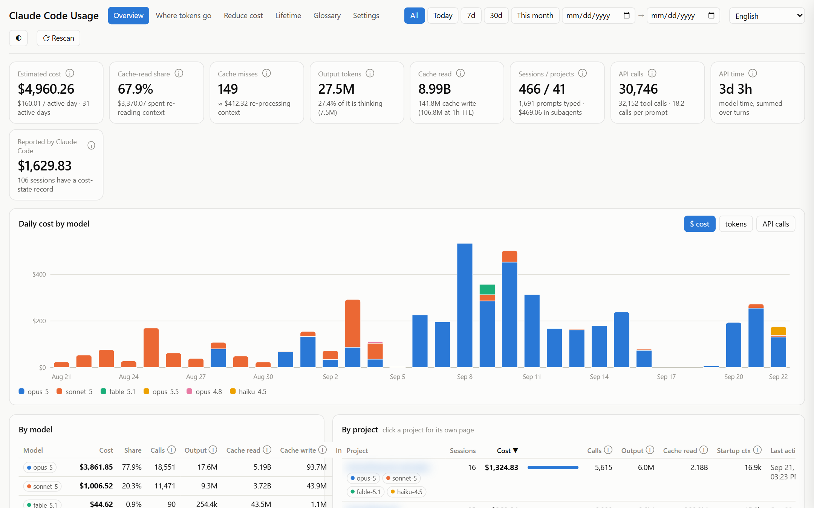
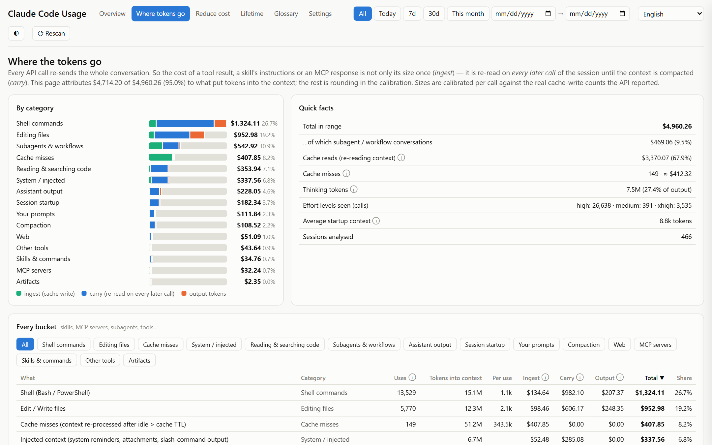
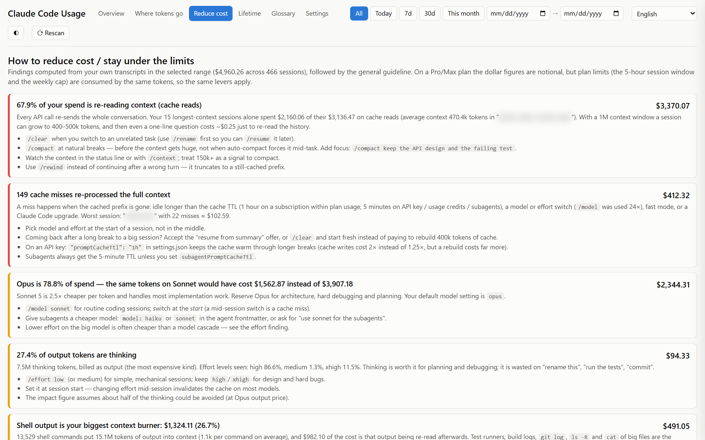
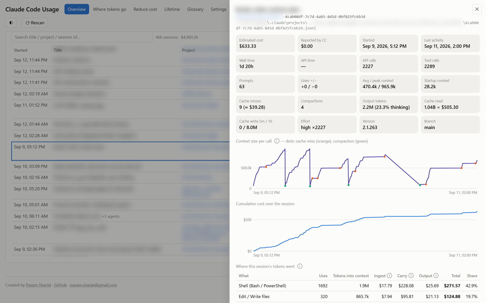
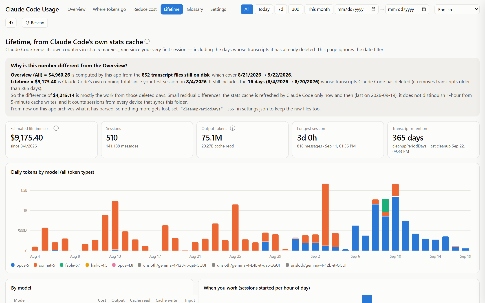
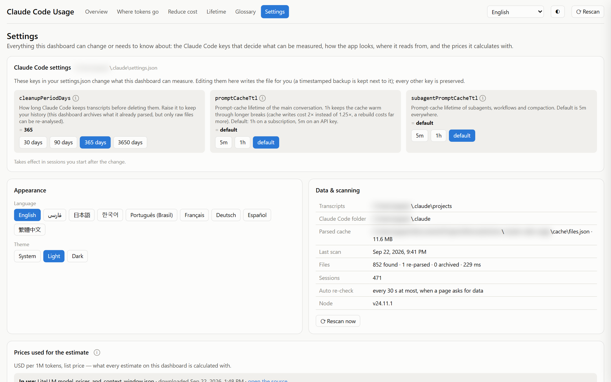
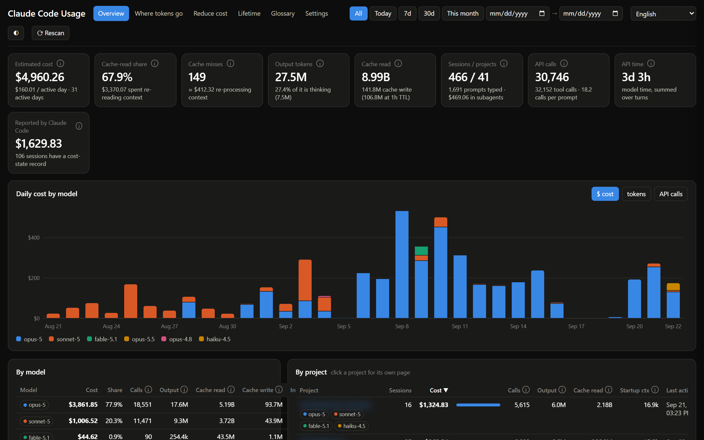

# Claude Code Usage Dashboard

A local dashboard that reads the transcripts Claude Code writes to
`~/.claude/projects/**/*.jsonl` and answers three questions:

1. **What did I spend?** — per session, project, model and day.
2. **What burned the tokens?** — every tool, skill, MCP server, subagent,
   slash command, your prompts, session startup, cache misses and compaction,
   each with the cost of putting it into the context *and* of re-reading it on
   every later call.
3. **How do I spend less?** — findings computed from your own data, with the
   exact commands and settings, plus the condensed official guidance.

Nothing leaves your machine: the app only reads files under `~/.claude` and
serves pages on localhost. No account, no API key, no telemetry.

Built with **Next.js 16 · TypeScript · Tailwind v4**. Available in nine
languages out of the box: English, Deutsch, Español, Français, Português
(Brasil), 日本語, 한국어, 繁體中文 and فارسی (RTL).



<sub>Project names and session titles are blurred in all screenshots.</sub>

---

## Quick start

```bash
git clone https://github.com/payamss/claude-code-usage.git
cd claude-code-usage
npm install
npm run build
npm start                 # → http://localhost:4747
```

`npm run dev` for development (hot reload, port 3000).

### Keep it running with pm2

```bash
npm run build
pm2 start ecosystem.config.js
pm2 save                  # and `pm2 startup` once, to survive a reboot
pm2 logs claude-usage
```

### Or with Docker

The container needs your `~/.claude` folder mounted; `docker-compose.yml` does
that for you.

```bash
docker compose up -d --build        # → http://localhost:4747
docker compose logs -f
```

- On Linux/macOS `${HOME}/.claude` is picked up automatically. On Windows, set
  the path first (PowerShell):
  `$env:CLAUDE_HOME="C:/Users/<you>/.claude"; docker compose up -d --build`
  — or put `CLAUDE_HOME=C:/Users/<you>/.claude` in a `.env` file next to the
  compose file.
- The mount is **read-only** by default. Remove the `:ro` suffix if you want the
  Settings card (on *Reduce cost*) to be able to write `cleanupPeriodDays` and
  the cache-TTL keys into `settings.json` for you.
- The parsed-transcript cache lives in the `claude-usage-cache` volume, so
  restarts are fast and transcripts Claude Code has deleted stay archived.
- The port is bound to `127.0.0.1` — drop that prefix in `docker-compose.yml`
  to reach it from other devices.
- The first scan inside a container is slower than a native run (bind-mount I/O
  on Docker Desktop: ~19 s for ~800 transcripts vs ~4 s native). Everything
  after that is served from the cache volume.

### Configuration

| Env var | Default | Meaning |
|---|---|---|
| `CLAUDE_HOME` | `~/.claude` | Claude Code's config folder |
| `CLAUDE_DIR` | `$CLAUDE_HOME/projects` | where the transcripts are |
| `RESCAN_SECONDS` | `30` | how often a request re-checks files for changes |
| `PORT` / `HOSTNAME` | `4747` / `127.0.0.1` | server binding (`npm start` / Docker) |

---

## Pages

| Page | What it shows |
|---|---|
| **Overview** `/` | Tiles (cost, cache-read share, misses, tokens, calls…), daily chart by model, model table, project table, session table. Click a session for the drawer. |
| **Project** `/project/<key>` | The same scoped to one project, plus its token attribution and heaviest tool results. |
| **Where tokens go** `/burn` | Cost attributed to what put tokens into the context, split into ingest / carry / output; heaviest single tool results; long-context sessions; sessions with cache misses. Filterable by category, sortable. |
| **Reduce cost** `/save` | Findings from your own data, sorted by impact, each with concrete actions; a **Settings** card that edits `settings.json` for you; then the condensed guideline with sources. |
| **Lifetime** `/lifetime` | Claude Code's own `stats-cache.json` — totals since your first session, including days whose transcripts were already deleted — and an explanation of why that number differs from the Overview. |
| **Glossary** `/help` | What every number means and how the attribution works. Every ⓘ in the UI opens the same text as a click popover. |
| **Settings** `/settings` | The Claude Code keys that decide what can be measured (written to `settings.json` for you), language and theme, where the data is read from + a manual rescan, and the price table behind the estimates. |

The session drawer shows context size per call (with cache-miss and compaction
markers), cumulative cost, the per-bucket breakdown and every prompt you typed.

### Screenshots

| | |
|---|---|
| **Where tokens go** — cost by category, split into ingest / carry / output | **Reduce cost** — findings from your own data, sorted by impact |
| [](docs/screenshots/burn.png) | [](docs/screenshots/save.png) |
| **Session drawer** — context size per call with cache-miss (orange) and compaction (green) markers | **Lifetime** — Claude Code's own stats cache, including deleted days |
| [](docs/screenshots/session.png) | [](docs/screenshots/lifetime.png) |
| **Settings** — `settings.json` keys, language, theme, data source, prices | **Dark theme** |
| [](docs/screenshots/settings.png) | [](docs/screenshots/overview-dark.png) |

---

## How the numbers are produced

**Cost** = tokens × list price (`src/lib/pricing.ts`). Claude Code writes one
JSONL line per content block, so the same API response appears several times
with the same `message.id`; the parser de-duplicates on it — without that,
totals come out roughly 2× too high.

| Model | input | output | cache write 5m | cache write 1h | cache read |
|---|---|---|---|---|---|
| claude-opus-5 / opus-4-8 | 5 | 25 | 6.25 | 10 | 0.50 |
| claude-sonnet-5 | 2 | 10 | 2.50 | 4 | 0.20 |
| claude-fable-5-1 | 10 | 50 | 12.50 | 20 | 0.25 |
| claude-haiku-4-5 | 1 | 5 | 1.25 | 2 | 0.10 |

**Keeping prices current.** The table is built into the app, so it works
offline and every figure is reproducible. Three ways to change it:

- **Settings → Prices → Refresh from source** downloads a public,
  machine-readable price list ([LiteLLM's
  `model_prices_and_context_window.json`](https://github.com/BerriAI/litellm/blob/main/model_prices_and_context_window.json),
  a plain GET — nothing about you is sent), stores it in `cache/prices.json`,
  merges it over the built-in table and recomputes every session immediately.
  The card shows which source is in use, when it was downloaded, and marks any
  model whose price differs from the built-in one. "Back to built-in" deletes
  the file.
- **`npm run prices:refresh`** does the same against a running instance (handy
  from a cron job; `APP_URL=… ` to point it elsewhere).
- **Edit `src/lib/pricing.ts`** — the built-in table, and the place to add a
  model the source does not know yet. Bump `BUILTIN_UPDATED` when you do.

Models with no price are counted in tokens, cost $0, and the UI warns about
them by name.

**Attribution.** For each API call the transcript gives the real token counts
(cache write + uncached input = what newly entered the context). The parser
records what arrived since the previous call — the model's answer, each tool
result (linked by `tool_use_id`, plus the tool input, e.g. the file content
passed to `Write`), a skill's instructions, subagent hand-backs, your prompt,
system reminders — and splits those tokens among them by character length. Each
item then gets:

- **ingest** — its cache-write cost, paid once;
- **carry** — it is re-read on every later call until a compaction or `/clear`
  (detected as a >40 % drop in context size);
- **output** — the output tokens of the call that decided to use it.

Cache misses (context re-processed after the cache expired, a model/effort
switch, an upgrade…) are detected when a call's cache read collapses while the
context does not shrink, and get their own bucket. Subagent transcripts
(`<session>/subagents/**/*.jsonl`, including workflow agents) are separate
conversations and appear as *Subagent run: `<type>`* with their full cost.
Buckets add up to the session total within a few percent.

"Reported by Claude Code" is `totalCostUSD` from the transcript's `cost-state`
record. A resumed session carries the previous session's total forward, so it
can over-count — the estimate is the primary number everywhere.

**Retention.** Claude Code deletes transcripts older than `cleanupPeriodDays`
(30 by default). Once this app has parsed a file, its numbers stay in
`cache/files.json` and the session is marked *archived*, so your history
survives the cleanup. Raise the value from the Settings card to keep the raw
files as well.

---

## Project layout

```
src/lib/pricing.ts     price table + cost helpers
src/lib/parser.ts      JSONL parser + Scanner (on-disk cache, archives deleted transcripts)
src/lib/analyze.ts     per-conversation attribution (ingest / carry / output)
src/lib/store.ts       singleton scanner + the aggregation behind each API route
src/lib/settings.ts    validated read/write of ~/.claude/settings.json
src/lib/prices.ts      price refresh from a public dataset (cache/prices.json)
src/app/api/*          overview · breakdown · lifetime · session/[id] · refresh · settings · info · prices
src/app/*/page.tsx     routes
scripts/check-i18n.mjs validates translation files
scripts/gen-icons.mjs  regenerates favicon.ico + apple-icon.png from src/app/icon.svg
src/components/*       UI (client components); the charts are plain SVG, no chart library
src/i18n/*.json        translations
```

No runtime dependencies beyond Next/React: the parser is plain Node `fs` +
`readline`, the charts are hand-written SVG.

---

## Translations

Strings live in `src/i18n/<lang>.json`: flat keys, `{placeholders}`, HTML
allowed in the long texts. Labels produced on the server (bucket and category
names) are translated through the `labels`, `prefixes` and `suffixes` maps at
the end of each file.

```bash
cp src/i18n/en.json src/i18n/id.json    # translate the values
npm run check:i18n                      # keys, placeholders, markup, _meta
```

…then register it in `src/lib/i18n.tsx`: import the JSON, add the code to the
`Lang` type, and add entries to `LANGS` and `LOCALES` (the `Intl` locale used
for dates and numbers). The switcher in the header and on the Settings page
picks it up automatically.

| Code | Language | Code | Language |
|---|---|---|---|
| `en` | English (source) | `ja` | 日本語 |
| `de` | Deutsch | `ko` | 한국어 |
| `es` | Español | `zh-TW` | 繁體中文 |
| `fr` | Français | `fa` | فارسی (RTL) |
| `pt` | Português (Brasil) | | |

**[TRANSLATING.md](TRANSLATING.md)** has a ready-made prompt you can hand to an
LLM agent, the full rules (what must never be translated), and the priority
list of languages. Farsi renders in Vazirmatn (self-hosted through `next/font`)
with RTL layout; numbers, code and file paths stay LTR and Latin in every
language. PRs with new languages are welcome.

---

## Author & contributing

Created by **[Payam Shariat](https://shariat.de)**, a fullstack developer based
in Germany — the concept, design and implementation are mine, released as open
source under the AGPL so others can use, study and build on it under the same
terms.

- Website: [shariat.de](https://shariat.de) — who I am and what else I build
- GitHub: [github.com/payamss](https://github.com/payamss)
- Repo: [github.com/payamss/claude-code-usage](https://github.com/payamss/claude-code-usage)
- Contact: payam.shariat@gmail.com

Issues and PRs are welcome — bug fixes, new [languages](TRANSLATING.md), new
price entries in `src/lib/pricing.ts`, new findings on the *Reduce cost* page.
See [CONTRIBUTING.md](CONTRIBUTING.md). Open an issue first for anything
beyond a small fix so we can agree on the approach before you spend time on it.

## Licence

**GNU AGPL v3** (`LICENSE`) — free to use, study, modify and share, including
at work; if you run a *modified* version as a service for others you must offer
them the source.

For closed-source redistribution, hosting a modified version commercially, or a
support/warranty agreement, a commercial licence is available — see
[COMMERCIAL.md](COMMERCIAL.md) (payam.shariat@gmail.com).

Contributions are welcome under the AGPL plus a relicensing grant, so the
commercial option stays available — see [CONTRIBUTING.md](CONTRIBUTING.md).

Not affiliated with Anthropic. "Claude" and "Claude Code" are trademarks of
Anthropic; this project only reads the files Claude Code writes on your own
machine.
